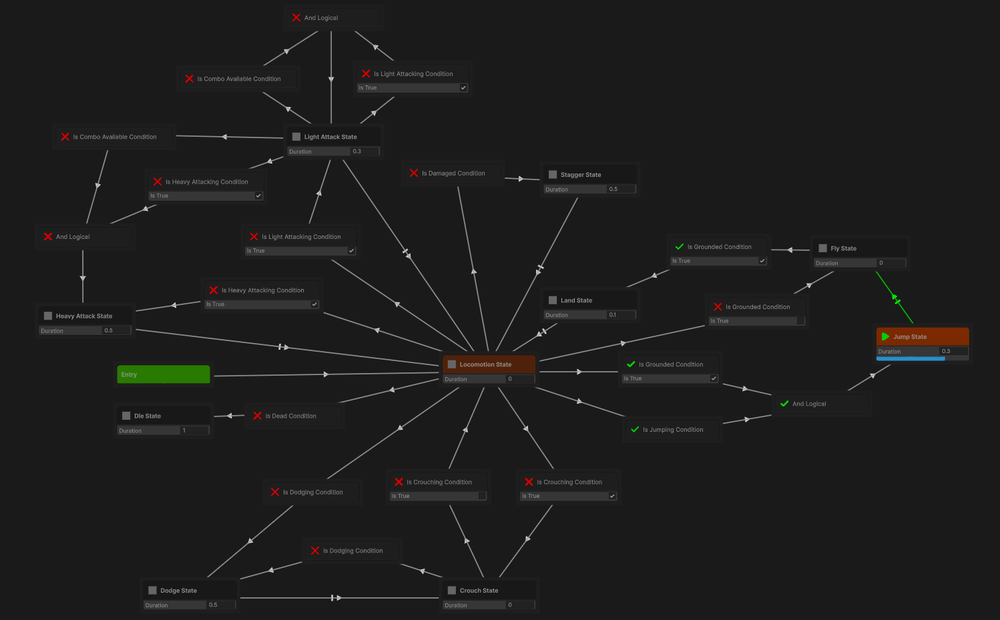

# GraphTools – FSM

A flexible Finite State Machine (FSM) editor for Unity, built using the GraphView API.

> Design FSMs visually, connect states and conditions, and see them in action at runtime — just like Unity's Animator window.

---

## ✨ Features

- 🎛️ Visual FSM Editor built with GraphView
- 🧩 Create and connect **states** and **conditions**
- 🔄 Runtime visualization of active states and transitions
- 🧠 Inspired by Unity's Animator-style graph editing
- 📦 Fully integrated into Unity via UPM
- 🔧 Extensible and data-driven design (ScriptableObject-based)

---

## 📦 Package Info

- **Name**: `com.dizy.graphtools.fsm`
- **Version**: `1.0.0`
- **Unity Version**: `2022.3` or newer
- **Namespace**: `Dizy.GraphTools.FSM`

---

## 🚀 Installation

### ▶️ From Git (recommended)

1. In Unity, open the **Package Manager**
2. Click the `+` button → **Add package from Git URL...**
3. Paste the following URL:
